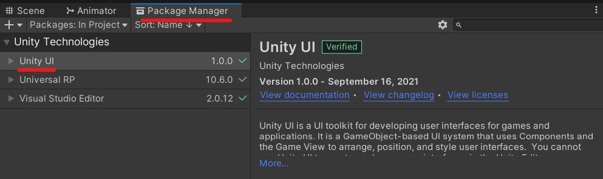
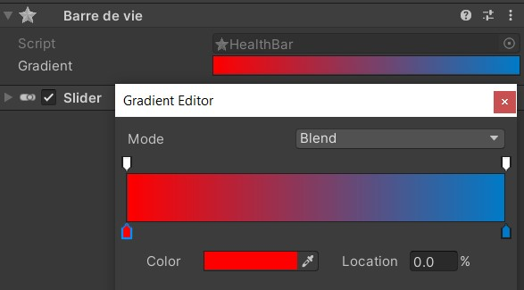

# La barre de vie

## Keskesé ?
Permet d'avoir une barre (slider) en UI qui évolue en fonction d'une valeur (de la vie, du mana ect.)

---

## Utilisation :

Placer le GameObject HealthBar enfant du truc qui a de la vie ou dans un coin du canvas

**ATTENTION**

Le script utilise UnityEngine.UI !!!

Il faut donc importer Unity UI dans le package Manager




Par défaut la barre descend du bleu au rouge. Pour choisir la couleur, setter le Grandient dans le component Barre de vie



---

## Code :
Associer la HealthBar (le script) au life manager du player ou autre.

 - Pour setter la valeur max du slider (à utiliser au Start où en cas de level up, réduction de pv max ect.). Value étant la nouvelle valeur max :
```cs
public void SetMaxHealth(int value)
```

- Pour mettre à jour la valeur du slider (à utiliser dès que la valeur actuelle de la vie change) :
```cs
public void SetHealth(int value)
```

On peut de préférence lier SetHealth à un event de vie perdue ou autre