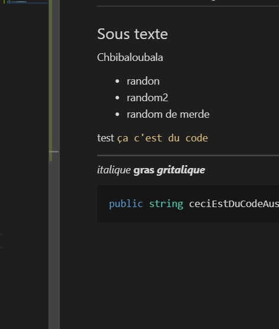

# Librarie_Unity

Bienvenue sur la librairie de Kagnous

## Sommaire

- [Barre de vie](https://github.com/kagnous/Librarie_Unity/blob/develop/Documentation~/HealthLifeDoc.md)
---

A partie de là c'est des notes de comment on présente un README

test `ça c'est du code`



*italique* **gras** ***gritalique***

```cs
public string ceciEstDuCodeAussi;
```